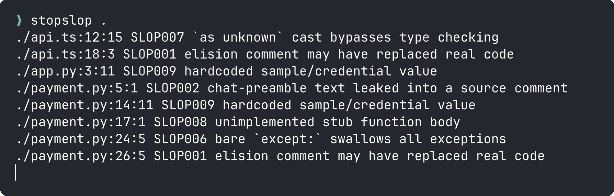
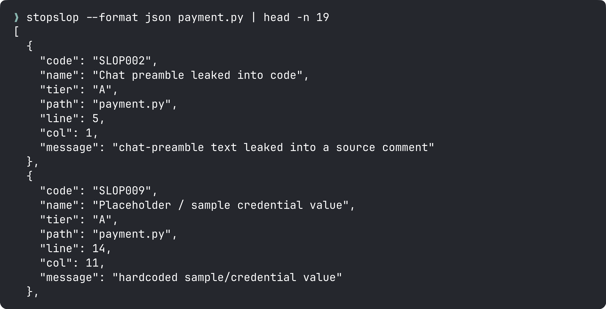

<p align="center">
  
</p>

# stopslop

Like Ruff, but for AI slop.

[](https://github.com/mgiovani/ai-stop-slop/actions/workflows/ci.yml)
[](LICENSE)
<!-- [](https://crates.io/crates/stopslop) -->


Your linter can't see `// ... rest of code unchanged`. ESLint, Ruff, and
Clippy throw away comment and string content before analysis: exactly
where AI coding artifacts live. stopslop reads what they discard: leaked
chat preambles, elision comments that silently deleted code, stray markdown
fences, placeholder credentials, and package imports that don't resolve to
anything you declared. It reads your prose too: Markdown, MDX, plain text,
and reST get the same deterministic treatment. One static binary, no LLM at
scan time: same input, same output, every run.

- One fast static binary, zero config to get started.
- Deterministic: no LLM calls, no API calls, no network access at scan time.
- Built for CI: exit codes, SARIF, JSON, and inline suppressions.

## Why your existing linter misses this

ESLint, Ruff, and Clippy parse comments and strings as trivia their default
rule sets don't inspect, which is exactly where copy-pasted chat output and
truncated edits land. A few examples:

| Artifact | ESLint / Ruff / Clippy | stopslop |
|---|---|---|
| `// ... rest of code unchanged` | Not linted (comment content is ignored by default rules) | SLOP001 |
| Leaked chat preamble ("Certainly! Here's...") | Not linted (same reason) | SLOP002 |
| `x as unknown as T` type-escape chain | No stock rule (`as unknown` alone is valid, idiomatic TS) | SLOP007 |
| `YOUR_API_KEY`, `sk-...`-shaped secret | Not linted (string literal content is ignored by default rules) | SLOP009 |

`stopslop` is a deterministic linter for TypeScript, Python, Go, and Rust.
Every rule is a tree-sitter AST match or a regex over extracted
comments/strings: same input, same output, every time. This is a
**quality gate, not an AI-origin detector**: it doesn't try to prove a human
didn't write the code, it flags patterns that are junk regardless of who (or
what) produced them.

## Install

Not yet on crates.io. Install from git or from a local checkout:

```bash
cargo install --git https://github.com/mgiovani/ai-stop-slop
```

```bash
git clone https://github.com/mgiovani/ai-stop-slop
cd ai-stop-slop
cargo install --path .
```

<!-- Once published: cargo install stopslop -->

## Usage

```bash
stopslop                     # lint the current directory
stopslop src/ lib/            # lint specific paths
stopslop --format json .      # machine-readable output
stopslop --select SLOP001     # run only the elision rule
stopslop --select rhetoric    # run one rule group (see "Rule groups" below)
stopslop --ignore SLOP008     # run everything except stub detection
stopslop --list-rules         # print every rule with its group, tier, and default
stopslop --check-imports .    # also run SLOP010 (unresolved import) — opt-in
stopslop --config path.toml   # use a specific config file instead of ./stopslop.toml
stopslop --no-config          # ignore any stopslop.toml, CLI flags only
stopslop --write-baseline .   # record today's findings (see "Baseline" below)
stopslop --baseline .         # report only findings that aren't in the baseline
```

Example output:



`--format json` emits a flat array of findings; `--format sarif` emits a
SARIF 2.1.0 document for GitHub code scanning and similar tools.



## Rule groups

`SLOP0NN` numbers are chronological, not thematic, so a numeric prefix can't
express "just the rhetoric rules". Named groups can, and work anywhere a rule
code or prefix does — `--select`, `--ignore`, and the `select`/`ignore` keys in
`stopslop.toml`:

| Group | What it covers |
|-------|----------------|
| `artifact` | Mechanical leftovers from a generation session: chat turns, tool tokens, unfilled slots |
| `structure` | Structural code smells: swallowed errors, escaped types, stubs, speculative abstraction |
| `stdlib` | Code that rebuilds something the standard library or the platform already provides |
| `rhetoric` | Formulaic rhetorical shapes: clichés, staged reveals, manufactured significance |
| `verbosity` | Words that cost the reader something and return nothing: hedging, filler, padding |
| `sourcing` | Claims with no checkable source behind them |
| `format` | Typographic and Markdown affectations |

```bash
stopslop --select artifact,structure   # the mechanical, high-confidence rules only
stopslop --select SLOP --ignore verbosity  # everything except the density rules
```

Every rule belongs to exactly one group; a test enforces that the table stays
exhaustive, so a new rule can't quietly escape group selection. `--list-rules`
prints the full mapping.

## Baseline

Turning stopslop on for an existing codebase usually surfaces findings nobody
plans to fix today. A baseline grandfathers them so CI only fails on findings
that are **new**:

```bash
stopslop --write-baseline .   # writes .stopslop-baseline.json, exits 0
stopslop --baseline .         # later runs report only what isn't in it
```

Use `--baseline=path.json` / `--write-baseline=path.json` for a different file
(the `=` is required, so a bare `--baseline` doesn't swallow your scan path),
or set `baseline = ".stopslop-baseline.json"` in `stopslop.toml`.

Findings are matched by a fingerprint of `code + path + message` with digits
normalized out, not by line number, so editing above a finding doesn't
resurrect it and a density count drifting by one doesn't either. The file
stores a **count** per fingerprint: if a file has three accepted findings from
one rule, it absorbs exactly three, and a fourth is reported. Fix one and the
budget shrinks with it. The count ratchets down on its own; raising it takes a
deliberate `--write-baseline`.

Commit the baseline file so CI and local runs agree.

## Rules

| Code | Group | Name | Tier | Langs | Description |
|------|-------|------|------|-------|--------------|
| SLOP001 | artifact | Elision / "rest unchanged" comment | A | TS, TSX, Python, Go, Rust | A comment like `// ... rest unchanged` may mark code an AI dropped while truncating an edit |
| SLOP002 | artifact | Chat preamble leaked into code | A | TS, TSX, Python, Go, Rust | Chat-assistant preamble ("Certainly! Here's the updated...") pasted straight into a source comment |
| SLOP003 | artifact | Stray markdown code fence in source | A | TS, TSX, Python, Go, Rust | A bare ` ``` ` fence line left in source, usually from a whole file pasted out of a chat reply |
| SLOP004 | artifact | AI attribution / chat-share artifact | A | TS, TSX, Python, Go, Rust | "Generated by ChatGPT", a `claude.ai/share` link, or other chat-export junk in a comment |
| SLOP005 | structure | Empty / log-only catch | A | TS, TSX, Go, Rust | A `catch`/error branch that swallows the error with an empty body or just a log call |
| SLOP006 | structure | Broad / swallowing except | A | Python | A bare or overly broad `except:` that swallows the exception instead of handling it |
| SLOP007 | structure | Type-escape (`as any` / `as unknown` / `@ts-ignore`) | A | TS, TSX | `as any`, an `x as unknown as T` chain that fully escapes the type checker, or `@ts-ignore`/`@ts-nocheck` |
| SLOP008 | structure | Stub-only / unimplemented body | A | TS, TSX, Python, Go, Rust | A function whose entire body is `pass`/`...`/`throw new Error("not implemented")`/`todo!()`/empty |
| SLOP009 | structure | Placeholder / sample credential value | A | TS, TSX, Python, Go, Rust | A hardcoded `YOUR_API_KEY`, `example.com`, `sk-...`-shaped secret, or other sample value |
| SLOP010 | structure | Unresolved package import | B | TS, TSX, Python, Go, Rust | An imported package that isn't declared in the project's manifest or stdlib (opt-in, `--check-imports`) |
| SLOP011 | artifact | Assistant-response residue in prose | A | Markdown, MDX, Text, reST | A leftover chat-turn phrase (self-ID disclaimer, refusal boilerplate, a line-initial `Certainly!` opener, or a trailing `let me know if you have` closer) left unedited in prose |
| SLOP012 | artifact | LLM tool / citation artifact token | A | Markdown, MDX, Text, reST | A leftover search/citation-tool token (`turn0search0`, `:contentReference[oaicite:1]`, a `【12†L3】` marker, `utm_source=chatgpt.com`) left in text |
| SLOP013 | artifact | Unfilled template placeholder | A | Markdown, MDX, Text, reST | An unfilled placeholder (`[Your Name]`, `INSERT_SOURCE_URL_30`, a `date: 2025-XX-XX` stub) left in place of real content |
| SLOP014 | rhetoric | Formulaic cliché phrase | A | Markdown, MDX, Text, reST | A stock marketing/narrative cliché (`unlock the power of`, `in today's fast-paced world`, `a testament to`) |
| SLOP015 | verbosity | Hedging & filler-phrase density | B | Markdown, MDX, Text, reST | A document-wide density of hedging/filler phrases (`it's worth noting that`, `in conclusion`, `first and foremost`), opt-in |
| SLOP016 | verbosity | Overused-vocabulary density | B | Markdown, MDX, Text, reST | A document-wide density of overused vocabulary (`delve`, `tapestry`, `robust`, `leverage`) across enough distinct terms to read as filler, opt-in |
| SLOP017 | rhetoric | Rhetorical parallelism / false-depth scaffolding density | B | Markdown, MDX, Text, reST | A document-wide density of rule-of-three lists, `not only X but also Y` phrasing, and trailing `, underscoring its...` participles, opt-in |
| SLOP018 | format | Mid-prose em/en dash | A | Markdown, MDX, Text, reST | A mid-sentence em dash (`—`), en dash (`–`), or spaced ASCII `--` that should be rewritten out of the sentence (numeric ranges like `2020–2024`, and an attribution dash opening a block or blockquote like `— Oscar Wilde`, are exempt) |
| SLOP019 | format | Boldface & bold-lead-in list overuse | B | Markdown, MDX | Boldface overuse in body prose, or 3+ consecutive `- **Term**: ...` bold-lead-in list items, opt-in |
| SLOP020 | format | Typographic (smart) quotes in source | B | Markdown, MDX, Text, reST | Curly quotes/apostrophes in source where straight ASCII quotes are expected, opt-in |
| SLOP021 | format | Heading & marker formatting affectations | B | Markdown, MDX | Emoji used as a heading/list marker, headings written in Title Case against an otherwise sentence-case document, or headings stacked over two-sentence sections, opt-in |
| SLOP022 | rhetoric | Formulaic opener / rhetorical setup | A | Markdown, MDX, Text, reST | A throat-clearing or faux-insight opener (`Here's the thing`, `What nobody tells you`, `Plot twist:`), or a self-answered `Question? Answer.` pair opening a line |
| SLOP023 | rhetoric | Binary contrast / negative listing | A | Markdown, MDX, Text, reST | The `It's not X. It's Y.` / `The question isn't X, it's Y` shape, or a `Not a X. Not a Y.` fragment run |
| SLOP024 | rhetoric | Importance puffery / fake-strong verb | A | Markdown, MDX, Text, reST | An inflated significance claim (`marks a pivotal moment`, `solidifies its position`), or a `serves as a centralized hub`-style linking verb where plain `is` reads better |
| SLOP025 | sourcing | Unsourced weasel attribution | A | Markdown, MDX, Text, reST | Anonymous authority (`experts agree`, `studies show`) with no link, footnote, or citation anywhere on the line |
| SLOP026 | rhetoric | Dramatic colon reveal | B | Markdown, MDX, Text, reST | A short noun phrase, a colon, then a lowercase dramatic reveal (`The best part: it learns`), opt-in |
| SLOP027 | verbosity | Empty filler phrase & adverb density | B | Markdown, MDX, Text, reST | A document-wide density of empty phrases (`when it comes to`, `at its core`) and filler adverbs (`simply`, `actually`), opt-in |
| SLOP028 | verbosity | Weak verb phrase / vague quantifier | B | Markdown, MDX, Text, reST | A document-wide density of nominalizations (`made a decision`, `has the ability to`) and vague quantifiers used where a number belongs (`significantly improves`), opt-in |
| SLOP029 | rhetoric | Summary-recap ending / fake-profound kicker | A | Markdown, MDX, Text, reST | A closing block that restates the piece (`In conclusion`, `Overall`) or lands a mic-drop line (`It's already here.`) |
| SLOP030 | rhetoric | Dramatic fragmentation / robotic rhythm | B | Markdown, MDX, Text, reST | Stacked one-clause fragments (`That's it. That's the whole thing.`), consecutive `And`-initial sentences, or paragraph-wide repeated sentence shapes, opt-in |
| SLOP031 | rhetoric | Promotional / advertisement language | B | Markdown, MDX, Text, reST | Brochure register in technical prose (`boasts a`, `industry-leading`, `a hidden gem`) at document-wide density, opt-in |
| SLOP032 | verbosity | Hyphenated-compound overuse | B | Markdown, MDX, Text, reST | Stacked hyphenated modifiers used as filler (`end-to-end`, `data-driven`, `battle-tested`) at document-wide density, opt-in |
| SLOP033 | verbosity | Overlong sentence | B | Markdown, MDX, Text, reST | A sentence over 50 words, reported with its actual word count (URLs count as one word), opt-in |
| SLOP034 | verbosity | Synonym rotation across a closed concept set | B | Markdown, MDX, Text, reST | One concept named two ways in one document (`check` and `verify`, `config` and `settings`) where technical writing should fix one term, opt-in |
| SLOP035 | rhetoric | Outline-shaped filler section | B | Markdown, MDX, Text, reST | A `Challenges and Future Prospects`-style section heading, or `despite these challenges` boilerplate, standing in for specifics, opt-in |
| SLOP036 | rhetoric | Diff-anchored documentation | B | Markdown, MDX, Text, reST | Docs narrating a change (`was added to replace`, `no longer requires`) instead of describing current behavior; changelogs and migration guides are exempt, opt-in |
| SLOP037 | stdlib | Reinvented stdlib / native platform feature | B | TS, TSX, Python, Go, Rust | Hand-rolled code where a standard-library or platform primitive exists (`JSON.parse(JSON.stringify(x))`, `for i in range(len(xs))`, `ioutil.ReadFile`), opt-in |
| SLOP038 | stdlib | Dependency with a stdlib equivalent | B | TS, TSX | An import of a package the platform already covers (`moment`, `uuid`, `node-fetch`, `left-pad`), opt-in |
| SLOP039 | structure | Pass-through wrapper function | B | TS, TSX, Python, Go, Rust | A function whose whole body forwards its own parameters, unchanged, to another function, opt-in |
| SLOP040 | structure | Single-implementation interface / abstract | B | TS, TSX, Python | An interface or abstract class with exactly one implementor in the same file: abstraction with no second user, opt-in |

Tier A findings fail the run (exit 1). Tier B is warn-only and never fails CI:
SLOP010, the prose density and style rules (SLOP015–017, SLOP019–021,
SLOP026–028 and SLOP030–036), and the `stdlib`/abstraction code rules
(SLOP037–040). These all have real false-positive risk — private registries
and dynamic imports for SLOP010, subjective style and density judgment calls
for the prose rules, and a hand-rolled helper that legitimately differs from
its stdlib counterpart for SLOP037–040 — so they're opt-in
(`--select SLOP015`, `--select stdlib`, etc.) and non-blocking by design.

Findings that have one concrete replacement print it on a second line:

```
src/util.ts:14:11 SLOP037 deep clone via a JSON round trip
    fix: use `structuredClone(value)`
```

`--format json` carries the same text in a `fix` field, omitted when a rule
flags a document-wide pattern with no single substitutable span.

Note on SLOP007: a bare `x as unknown` is not flagged on its own: it's a
legitimate first step in TypeScript's narrowing idiom. Only the chained form,
`x as unknown as T`, is flagged, since that's the pattern that fully defeats
the type checker.

## Prose linting

stopslop also lints `.md`, `.mdx`, `.txt`, and `.rst` files: same binary,
same deterministic regex/structural matching, no LLM involved in the scan.
SLOP011–014 catch mechanical, high-confidence artifacts (leftover chat-turn
phrasing, citation-tool tokens, unfilled placeholders, stock clichés);
SLOP018 flags every mid-prose dash outright (the one exemption is a
block-opening attribution dash like `— Oscar Wilde`). Those, plus the
formulaic-shape rules SLOP022–025 and SLOP029, are on by default (Tier A).
The rest are document-wide density and style checks — hedging, overused
vocabulary, rhetorical parallelism, boldface overuse, smart quotes, heading
formatting, promotional register, hyphen stacking, sentence length, synonym
rotation, outline filler, and change-narrating docs. These are judgment
calls rather than mechanical certainties, so they're Tier B, opt-in, and
warn-only. Enable them with `--select SLOP015`, by group (`--select
verbosity`), or `--select SLOP` for everything. Expect some noise from them:
this very README trips SLOP017 under `--select SLOP`, since its prose is
heavy on the enumerations that rule counts. That's Tier B working as
intended, a lead to investigate rather than a verdict. As with the rest of
stopslop, this is a writing-quality gate, not a claim about who or what wrote
the text: every rule flags a concrete pattern (a stale phrase, an unfilled
slot, a density threshold), never "this is AI-generated."

## Suppression

Two escape valves, both plain comments so they work in any language's
comment syntax:

- `// ai-slop-ignore`: suppresses findings on that line and the line below
  it (so it works whether the comment is trailing or sits above the flagged
  line).
- `// ai-slop-ignore-file`: anywhere in the file, drops every finding in
  that file.

In Markdown/MDX/Text/reST files, use the HTML comment form instead:
`<!-- ai-slop-ignore -->` / `<!-- ai-slop-ignore-file -->`, with the same
two-line and whole-file suppression semantics.


## Path exemptions

Rules that are path-gated (SLOP005, 006, 008, 009, 010) don't run inside
directories or files that look like tests or generated/vendored code, since
empty catches, broad excepts, and unresolved imports are all legitimately
common there:

- Any path segment named `tests`, `test`, `__tests__`, `testdata`,
  `fixtures`, `fixture`, `mocks`, `mock`, `examples`, `example`, `vendor`,
  `node_modules`, or `generated`.
- Filenames matching `test_*`, `conftest.py`, `*_test.go`, `*_test.py`,
  `*.test.ts(x)`, `*.spec.ts(x)`, `*.pyi`, `*.pb.go`, `*_pb2.py`, `*.min.js`.

SLOP001–004 (the junk-text rules) are **not** path-gated: a leaked chat
preamble or elision comment is junk in a test file too.

## Config file

`stopslop.toml` in the current directory (or pass `--config path`); CLI
flags override it:

```toml
select = []                 # rule codes/prefixes/groups to run (empty = all default-on rules)
ignore = ["SLOP009", "verbosity"]  # rule codes/prefixes/groups to subtract
exclude = ["**/generated/**"]      # extra walker excludes, on top of .gitignore
check-imports = false
baseline = ".stopslop-baseline.json"  # subtract findings recorded here (omit to disable)
```

Use `--no-config` to ignore any `stopslop.toml` present.

## `--check-imports`

SLOP010 cross-references each import against the project's manifest
(`pyproject.toml`/`requirements.txt`, `package.json`/`tsconfig.json`,
`go.mod`, `Cargo.toml`) plus an embedded stdlib/builtin list per language.

Honest caveats:

- If no manifest is found for a language, that language's checks are
  skipped silently rather than risk false positives.
- It's a static namecheck, not a resolver: workspace/path dependencies,
  dynamic imports, and unusual build setups can still false-positive or
  false-negative.
- It never fails the build on its own (Tier B): treat it as a lead to
  investigate, not a hard gate.

## Exit codes

- `0`: no findings, or Tier B findings only.
- `1`: at least one Tier A finding.
- `2`: usage error or a path that couldn't be scanned.

## Non-goals

- **Not an AI-origin detector.** stopslop never claims code *was* written by
  an AI, only that a pattern in it is junk regardless of origin.
- **Not a correctness checker.** It doesn't run your code or understand what
  it's supposed to do: a stub function that's genuinely fine (e.g. an
  intentionally unimplemented trait default) can still need a suppression
  comment.
- **No member-level hallucination detection.** It can't tell you that
  `requests.get_json()` isn't a real method: that's a type checker's job.
- **No general code-comment style/verbosity grading.** In code files it
  flags specific junk patterns (preamble, attribution, elision), not
  comment style or verbosity in general. Prose files additionally get the
  document-wide density/style checks in [Prose linting](#prose-linting)
  above, but those are all Tier B, opt-in, warn-only judgment calls, not a
  house-style grader.

## License

MIT (see [LICENSE](LICENSE)).

stopslop's own CI fails if its source contains slop: every push runs
`cargo run -- src` against the project's own code as a gate, alongside
`cargo fmt`, `cargo clippy`, and `cargo test`.
